# Kafka Learning Checklist

## Phase 1: Setup

1. Install Apache Kafka
2. Run Kafka (KRaft mode, no ZooKeeper)
3. Verify Kafka is running

Used Docker
    docker run -d --name kafka -p 9092:9092 ^
    -e KAFKA_PROCESS_ROLES=broker,controller ^
    -e KAFKA_NODE_ID=1 ^
    -e KAFKA_CONTROLLER_QUORUM_VOTERS=1@localhost:9093 ^
    -e KAFKA_LISTENERS=PLAINTEXT://:9092,CONTROLLER://:9093 ^
    -e KAFKA_ADVERTISED_LISTENERS=PLAINTEXT://localhost:9092 ^
    -e KAFKA_CONTROLLER_LISTENER_NAMES=CONTROLLER ^
    -e KAFKA_OFFSETS_TOPIC_REPLICATION_FACTOR=1 ^
    apache/kafka:latest

# Line-by-line explanation

## 1. Start container
docker run -d --name kafka -p 9092:9092

### Meaning:

* `docker run` → start container
* `-d` → run in background
* `--name kafka` → container name = kafka
* `-p 9092:9092` → expose Kafka to your machine

Result:
Kafka available at: localhost:9092

## 2. Node identity
-e KAFKA_NODE_ID=1
This Kafka server gets ID = 1

## 3. Roles (VERY IMPORTANT)
-e KAFKA_PROCESS_ROLES=broker,controller

This node does 2 jobs:

* **broker** → stores data (topics, partitions)
* **controller** → manages cluster decisions

One machine = data + brain

## 4. Controller quorum (cluster coordination)
-e KAFKA_CONTROLLER_QUORUM_VOTERS=1@localhost:9093

This defines:
* who is the controller
* how Kafka agrees on cluster state

“Node 1 is controller at localhost:9093”

## 5. Listeners (ports Kafka uses internally)
-e KAFKA_LISTENERS=PLAINTEXT://:9092,CONTROLLER://:9093
 Kafka opens 2 ports:

| Port | Purpose                           |
| ---- | --------------------------------- |
| 9092 | Producer/Consumer traffic         |
| 9093 | Internal controller communication |

## 6. Advertised listener (VERY IMPORTANT)
-e KAFKA_ADVERTISED_LISTENERS=PLAINTEXT://localhost:9092

This tells clients:

“Connect to Kafka at localhost:9092”
Without this:
* producers/consumers won’t connect properly

## 7. Controller listener name
-e KAFKA_CONTROLLER_LISTENER_NAMES=CONTROLLER
Use CONTROLLER port (9093) for cluster coordination

## 8. Replication factor
-e KAFKA_OFFSETS_TOPIC_REPLICATION_FACTOR=1
    Kafka internally stores consumer offsets
    Default expects 3 brokers
    We only have 1 broker → so set it to 1

## 9. Image
apache/kafka:latest

# Final simple mental model

Docker runs Kafka container
   ↓
Broker handles data (topics, messages)
   ↓
Controller manages cluster decisions
   ↓
Clients connect via port 9092

# One-line summary
This command starts a single-node Kafka server with broker + controller roles, exposes it on port 9092, and configures how producers/consumers connect.

Stop the container

    docker stop kafka

## Phase 2: Kafka CLI 

## END TO END FLOW
    docker start kafka

    docker ps

    docker exec -it kafka bash

    (if not work for creating topic use prefix - /opt/kafka/bin/)

    CREATE TOPIC    : /opt/kafka/bin/kafka-topics.sh --create --topic test-topic --bootstrap-server localhost:9092 --partitions 1 --replication-factor 1
    UPDATE TOPIC    : kafka-topics.sh --alter --topic test-topic --partitions 3 --bootstrap-server localhost:9092

    DELETE TOPIC    : /opt/kafka/bin/kafka-topics.sh --delete --topic test-topic --bootstrap-server localhost:9092
    LIST TOPIC      : /opt/kafka/bin/kafka-topics.sh --list --bootstrap-server localhost:9092

    CREATE PRODUCER : /opt/kafka/bin/kafka-console-producer.sh --topic test-topic --bootstrap-server localhost:9092
    CREATE CONSUMER : /opt/kafka/bin/kafka-console-consumer.sh --topic test-topic --from-beginning --bootstrap-server localhost:9092

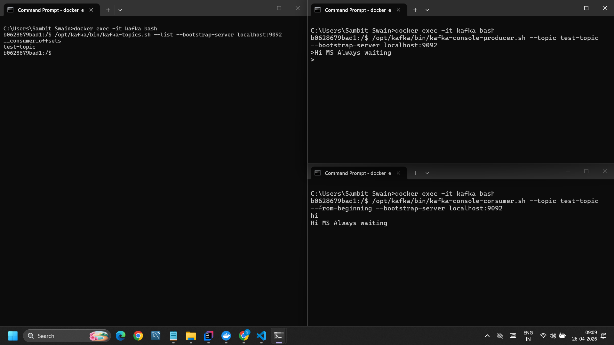

4. Create a topic
    CREATE TOPIC    : /opt/kafka/bin/kafka-topics.sh --create --topic test-topic --bootstrap-server localhost:9092 --partitions 1 --replication-factor 1
    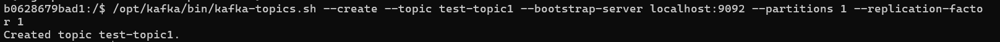

5. List topics
    LIST TOPIC      : /opt/kafka/bin/kafka-topics.sh --list --bootstrap-server localhost:9092
    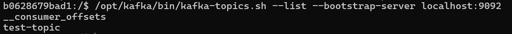

6. Describe a topic
    DESCRIBE OFFSET : /opt/kafka/bin/kafka-topics.sh --describe --topic test-topic --bootstrap-server localhost:9092
    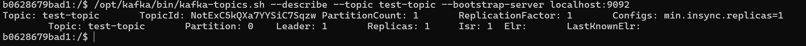

7. Produce messages (CLI producer)
    /opt/kafka/bin/kafka-console-producer.sh --topic test-topic --bootstrap-server localhost:9092

8. Consume messages (CLI consumer)
    /opt/kafka/bin/kafka-console-consumer.sh --topic test-topic --from-beginning --bootstrap-server localhost:9092

## Phase 3: Topics & Partitions

9. Create topic with multiple partitions
    /opt/kafka/bin/kafka-topics.sh --create --topic multi-part-topic --bootstrap-server localhost:9092 --partitions 3 --replication-factor 1

10. Send messages and observe distribution
    NOT USING KEY - (sticky batching)
    /opt/kafka/bin/kafka-console-producer.sh --topic multi-part-topic --bootstrap-server localhost:9092

    FOR USING KEY - (hash based routing)
    /opt/kafka/bin/kafka-console-producer.sh --topic multi-part-topic --bootstrap-server localhost:9092 --property "parse.key=true" --property "key.separator=:"

11. Understand ordering within partitions
    /opt/kafka/bin/kafka-console-consumer.sh --topic multi-part-topic --bootstrap-server localhost:9092 --from-beginning --property print.value=true --property print.partition=true --property print.offset=true

    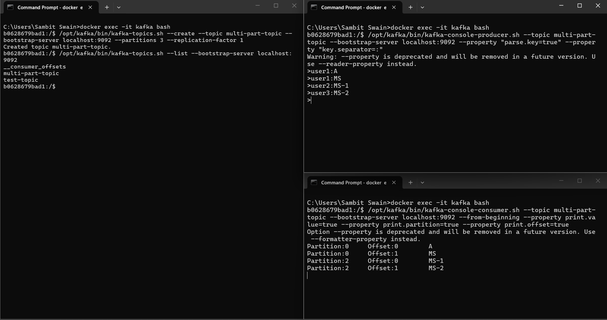

## Phase 4: Consumer Groups

    (You an use keys as mentioned above but this is jsut for observing the message duplication around consumer group so lets not use (sticky batching))

    CREATE A NEW TOPIC:
        /opt/kafka/bin/kafka-topics.sh --create --topic cg-topic --bootstrap-server localhost:9092 --partitions 3 --replication-factor 1

12. Run multiple consumers with same `group.id`
13. Observe load balancing (no duplication)
    
    TERMINAL - 1 (CONSUMER-1 (group-A))
    /opt/kafka/bin/kafka-console-consumer.sh --topic cg-topic --bootstrap-server localhost:9092 --group group-A --from-beginning --property print.value=true --property print.partition=true --property print.offset=true

    TERMINAL - 2 (CONSUMER-2 (group-A))
    /opt/kafka/bin/kafka-console-consumer.sh --topic cg-topic --bootstrap-server localhost:9092 --group group-A --from-beginning --property print.value=true --property print.partition=true --property print.offset=true

14. Run consumers with different `group.id`
15. Observe duplication across groups

    TERMINAL - 3 (CONSUMER-1 (group-B))
    /opt/kafka/bin/kafka-console-consumer.sh --topic cg-topic --bootstrap-server localhost:9092 --group group-B --from-beginning --property print.value=true --property print.partition=true --property print.offset=true

    CREATE PRODUCER:
        /opt/kafka/bin/kafka-console-producer.sh --topic cg-topic --bootstrap-server localhost:9092

    * Kafka behavior:
        * Inside same group:
            Partition → assigned to only one consumer
        * Across groups:
            Each group = full copy of stream

        A Kafka partition is assigned to only one consumer per consumer group, but multiple consumer groups can independently consume the same topic.

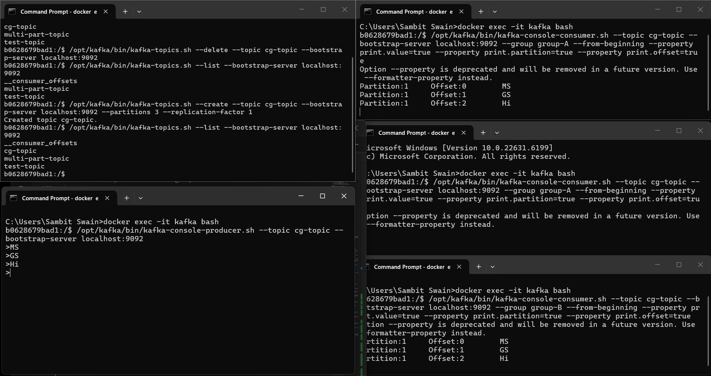

## Phase 5: Offsets & Commit

CREATE A NEW TOPIC:
    /opt/kafka/bin/kafka-topics.sh --create --topic offset-commit-topic --bootstrap-server localhost:9092 --partitions 3 --replication-factor 1

CREATE PRODUCER:
    /opt/kafka/bin/kafka-console-producer.sh --topic cg-topic --bootstrap-server localhost:9092

16. Consume messages and stop consumer

CREATE CONSUMER:
    /opt/kafka/bin/kafka-console-consumer.sh --topic cg-topic --bootstrap-server localhost:9092 --group group-A --from-beginning
    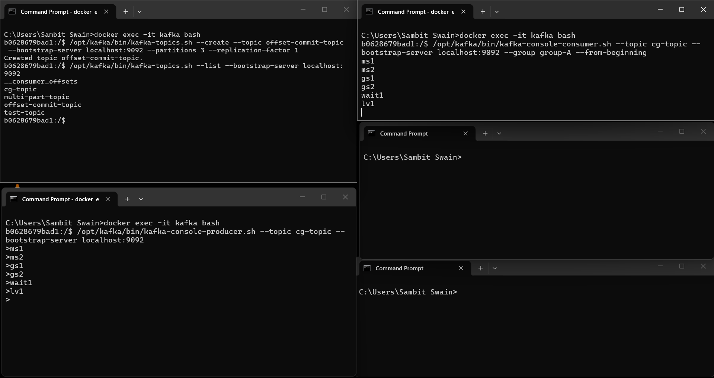

17. Restart and observe offset behavior

STOP CONSUMER:
    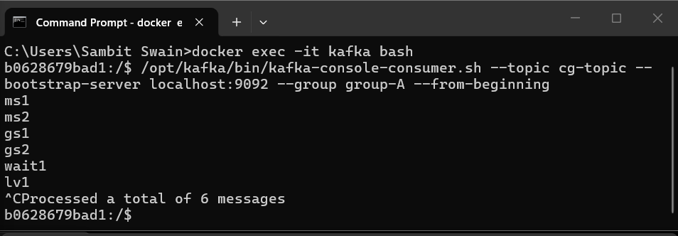

ADD SOME EXTRA MSG IN PRODUCER AFTER STOPPING CONSUMER
    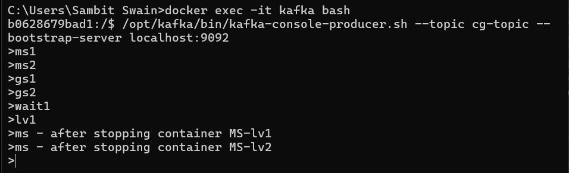

RESTART THE CONSUMER WITH SAME GROUP-ID
    /opt/kafka/bin/kafka-console-consumer.sh --topic cg-topic --bootstrap-server localhost:9092 --group group-A
    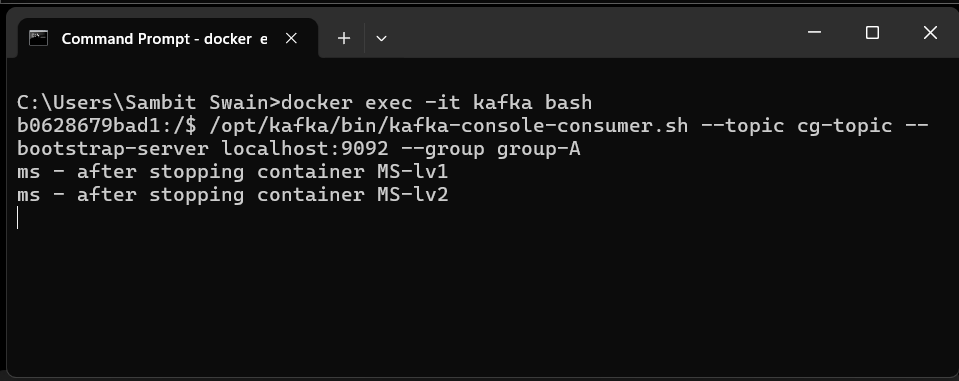

Offset = “last read position”
Kafka stores it in: __consumer_offsets (internal topic)

18. Learn:

* `earliest` vs `latest`

Case 1: earliest
    --group new-group --from-beginning (Reads:  msg-1 → msg-6 (ALL))

Case 2: latest  
    --group new-group-2                 (Reads ONLY new messages (after start))

| Situation                  | Behavior     |
| -------------------------- | ------------ |
| New group + no flag        | latest       |
| New group + from-beginning | earliest     |
| Existing group             | ignores both |

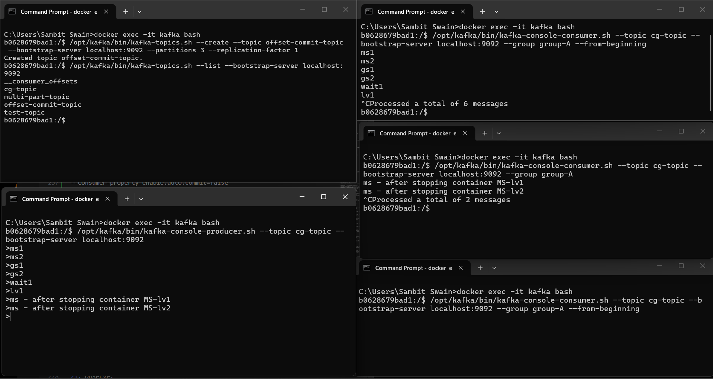

* auto commit vs manual commit

* Auto commit
By default Kafka:
    automatically saves offset every few seconds

So:
    message read → offset stored
    restart → continues

* Disable auto commit (IMPORTANT)
--consumer-property enable.auto.commit=false
--consumer-property auto.offset.reset=earliest

Now:
  Kafka does NOT save progress

Start consumer:
    /opt/kafka/bin/kafka-console-consumer.sh --topic cg-topic --bootstrap-server localhost:9092 --group group-C 
    --from-beginning --consumer-property enable.auto.commit=false --consumer-property auto.offset.reset=earliest

Read some messages
Stop consumer
Restart again

You will see:
    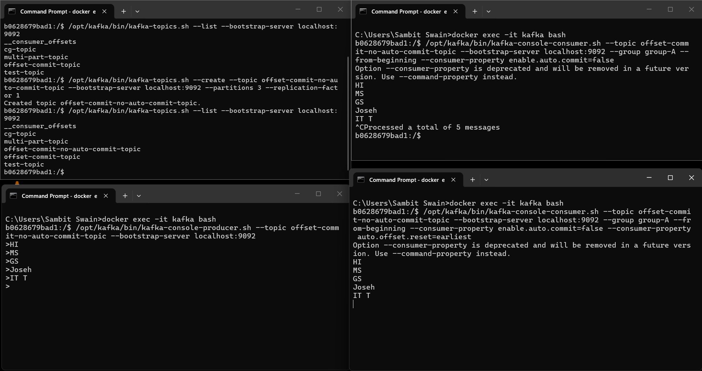
    ALL messages again

## Phase 6: Keys & Partitioning

19. Send messages **with key**
20. Send messages **without key**
21. Observe:

* Same key → same partition
* Ordering behavior

    This we have seen in the topics and partition

    CREATE-TOPIC:
        /opt/kafka/bin/kafka-topics.sh --create --topic key-topic --bootstrap-server localhost:9092 --partitions 3 --replication-factor 1

    WITHOUT KEY:
        Kafka decides → optimized batching → unpredictable distribution
        Kafka tries to optimize batching (not strict balancing)

        /opt/kafka/bin/kafka-console-producer.sh --topic key-topic --bootstrap-server localhost:9092

        /opt/kafka/bin/kafka-console-consumer.sh --topic key-topic --bootstrap-server localhost:9092 --from-beginning --property print.value=true --property print.partition=true
        
    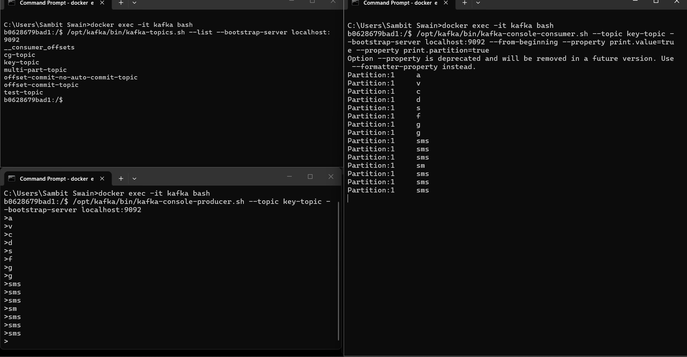

    WITH KEY:
        same key → same partition → ordered

        /opt/kafka/bin/kafka-console-producer.sh --topic key-topic --bootstrap-server localhost:9092 --property "parse.key=true" --property "key.separator=:"

        /opt/kafka/bin/kafka-console-consumer.sh --topic key-topic --bootstrap-server localhost:9092 --from-beginning --property print.value=true --property print.partition=true
    
    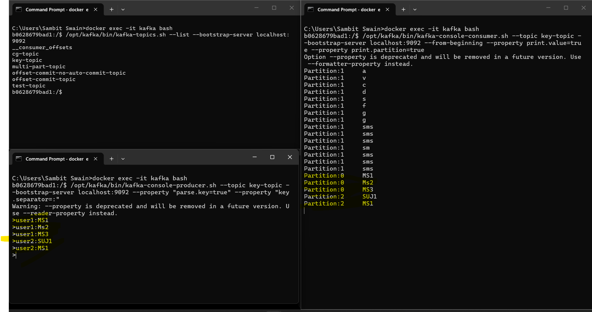

## Phase 7: Rebalance

22. Start multiple consumers
23. Stop one consumer
24. Add a new consumer
25. Observe partition reassignment

# Phase 7: Rebalance

## 🔹 Step 0: Create topic

    /opt/kafka/bin/kafka-topics.sh --create --topic rebalance-topic --bootstrap-server localhost:9092 --partitions 3 --replication-factor 1

## Step 1: Start Consumer 1

### TERMINAL 1

    /opt/kafka/bin/kafka-console-consumer.sh --topic rebalance-topic --bootstrap-server localhost:9092 --group group-R --from-beginning --formatter-property print.partition=true

Right now:

* Only **1 consumer**
* It will get **ALL partitions (0,1,2)**

## Step 2: Start Consumer 2 (trigger rebalance)

### TERMINAL 2

    /opt/kafka/bin/kafka-console-consumer.sh --topic rebalance-topic --bootstrap-server localhost:9092 --group group-R --from-beginning --formatter-property print.partition=true

What happens internally:

* Kafka pauses consumption
* Reassigns partitions

Expected:

* Consumer 1 → some partitions
* Consumer 2 → remaining partitions

C1 → Partition 0,1
C2 → Partition 2

## Step 3: Start Producer

### TERMINAL 3

    /opt/kafka/bin/kafka-console-producer.sh --topic rebalance-topic --bootstrap-server localhost:9092 --property "parse.key=true" --property "key.separator=:"

Type messages:

A
B
C
D
E
F

Observe:

* Messages split across consumers
* Based on partition ownership

## Step 4: Kill one consumer (REAL rebalance)

Stop **Consumer 2** (CTRL + C)

Now watch Consumer 1:

* It will suddenly start receiving **ALL partitions again**

That is rebalance:

Before:
C1 → P0, P1
C2 → P2

After C2 dies:
C1 → P0, P1, P2

## 🔹 Step 5: Add Consumer 3 (rebalance again)

### TERMINAL 4

/opt/kafka/bin/kafka-console-consumer.sh \
--topic rebalance-topic \
--bootstrap-server localhost:9092 \
--group group-R

 Again:

* Kafka pauses
* Redistributes partitions

### 🔥 Rebalance triggers:

* New consumer joins
* Consumer leaves
* Consumer crashes

### 🔥 What Kafka does:

1. Stop all consumers briefly
2. Recalculate partition ownership
3. Assign partitions again
4. Resume consumption

# Important

During rebalance:

* Consumers may look **stuck**
* Or pause for few seconds

### Hands On

CREATE TOPIC
    /opt/kafka/bin/kafka-topics.sh --create --topic rebalance-topic --bootstrap-server localhost:9092 --partitions 3 --replication-factor 1

CREATE PRODUCER
    /opt/kafka/bin/kafka-console-producer.sh --topic rebalance-topic --bootstrap-server localhost:9092 --property "parse.key=true" --property "key.separator=:"

CREATE CONSUMER
    /opt/kafka/bin/kafka-console-consumer.sh --topic rebalance-topic --bootstrap-server localhost:9092 --group group-R --from-beginning --formatter-property print.partition=true

ONE CONSUMER
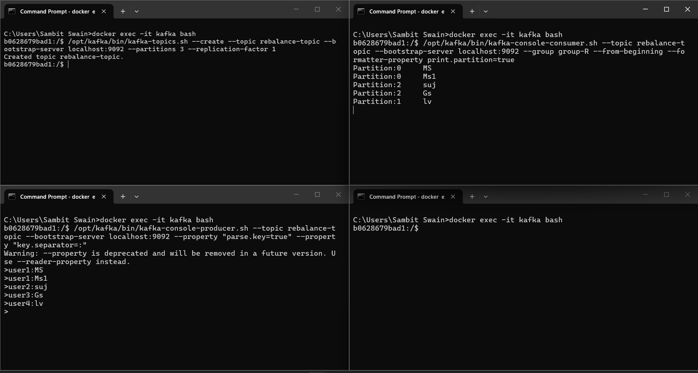

TWO CONMSUMER (Partitions are distributed among consumer)
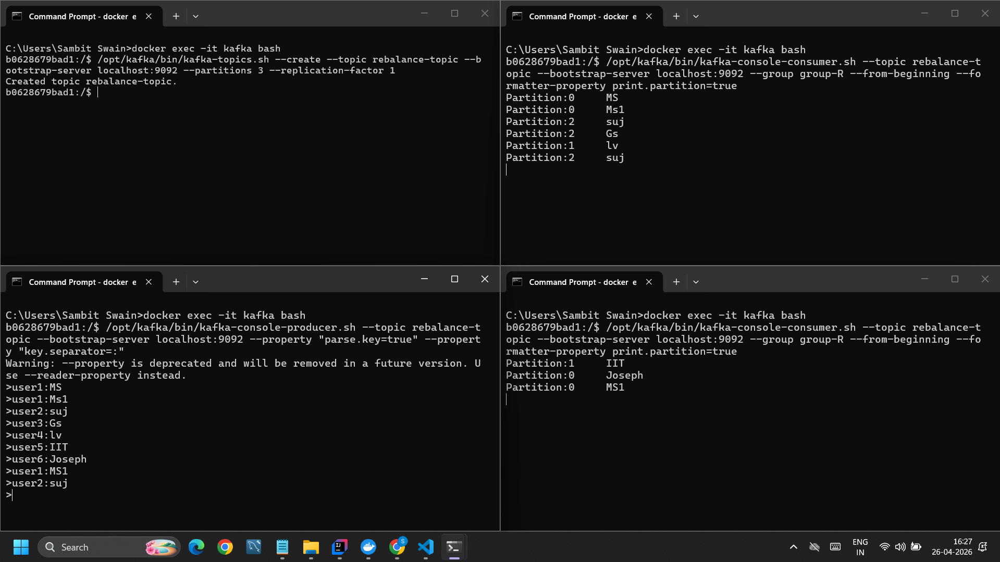

# Summary
 Rebalance is Kafka redistributing partitions among consumers when group membership changes.

## Phase 8: Brokers & Replication

26. Create topic with replication factor
27. Understand leader & follower
28. Learn fault tolerance behavior

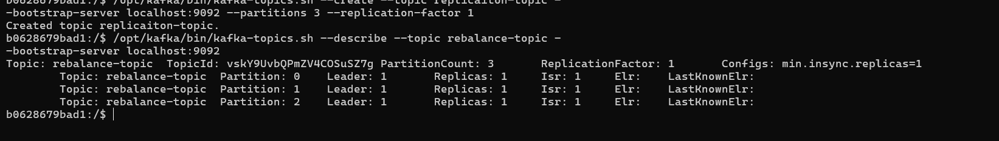

## Phase 9: Basic Configs (Light Learning)

29. Producer configs:

* `acks` (0, 1, all)
* retries
* serializers

30. Consumer configs:

* `auto-offset-reset`
* `enable-auto-commit`
* `max.poll.interval.ms`

# Phase 9: Basic Kafka Configs (Quick Guide)

## Producer Configs

### 1. `acks`
Defines when Kafka acknowledges a message.
* `acks=0` → No acknowledgment (fastest, data loss possible)
* `acks=1` → Leader acknowledges (balanced)
* `acks=all` → Leader + replicas acknowledge (safest)

Recommended:
acks=all

### 2. `retries`
Number of times producer retries sending a failed message.
retries=3
Helps handle temporary failures (network, broker issues)

### 3. `serializers`
Convert data into bytes before sending to Kafka.

Common serializers:
* String → `StringSerializer`
* JSON → `JsonSerializer`
* Integer → `IntegerSerializer`

Example:
key.serializer=org.apache.kafka.common.serialization.StringSerializer
value.serializer=org.apache.kafka.common.serialization.StringSerializer

## Consumer Configs

### 4. `auto-offset-reset`
Defines where to start reading if no offset exists.
* `earliest` → Read from beginning
* `latest` → Read only new messages

* Works **only for new consumer groups**
* Ignored if offsets already exist

### 5. `enable-auto-commit`
Controls offset committing behavior.
* `true` → Kafka auto-commits offsets
* `false` → Manual commit (safer)

Recommended:
enable-auto-commit=false

### 6. `max.poll.interval.ms`
Maximum time allowed between polls before Kafka considers consumer dead.
max.poll.interval.ms=300000

If exceeded:
* Consumer removed
* Rebalance triggered

## Summary

### Producer
acks       → reliability
retries    → retry on failure
serializer → data conversion

### Consumer
auto-offset-reset → where to start (new groups only)
auto-commit       → offset control
max.poll.interval → consumer timeout

## Defaults
Producer:
acks=all
retries=3+

Consumer:
enable-auto-commit=false
auto-offset-reset=earliest

## Summary
    Kafka producer configs control message delivery guarantees, while consumer configs control how messages are read and offsets are managed.

### WILL BE COVERING IN SPRING BOOT
## Phase 10: Java Kafka (No Spring)

31. Create simple producer (Java)
32. Create simple consumer (Java)
33. Send & receive messages programmatically

## Phase 11: Spring Boot Kafka

34. Add Kafka dependency
35. Configure `group-id`
36. Use `@KafkaListener`
37. Send JSON messages
38. Build producer API
39. Build consumer service

## Phase 12: Advanced

40. Manual offset commit
41. Retry handling
42. Error handling
43. Idempotent processing